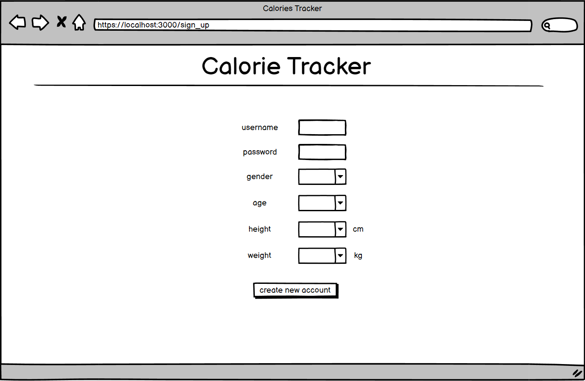
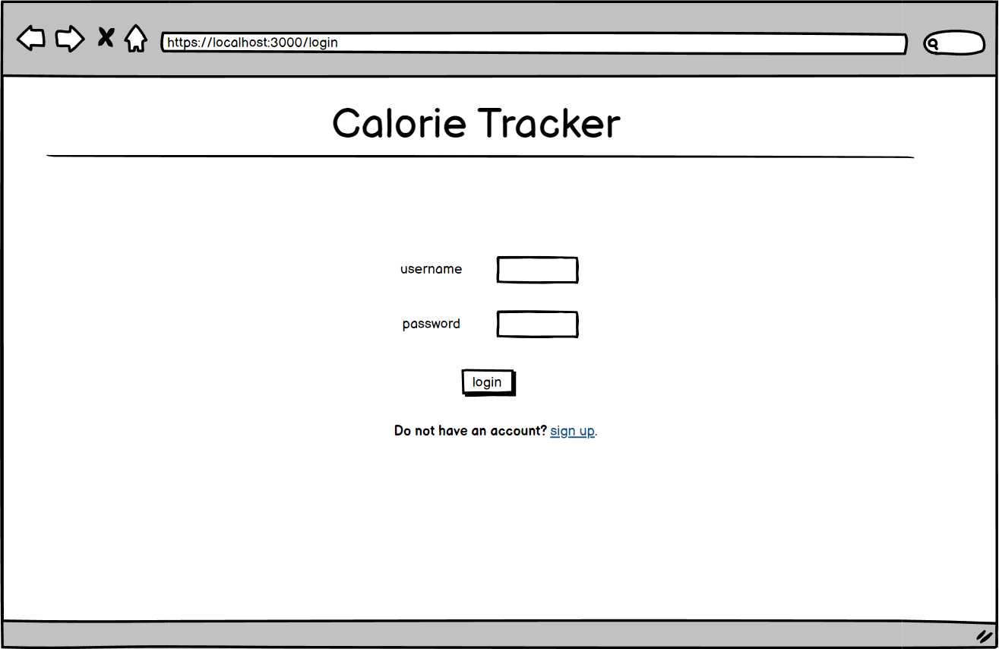
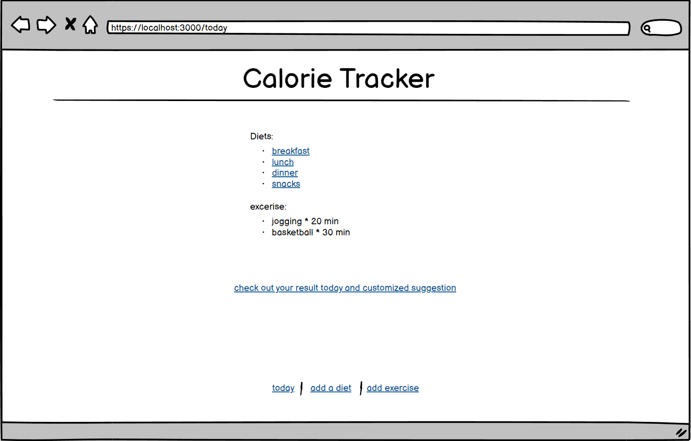
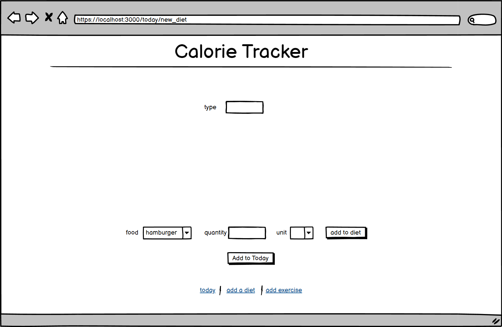
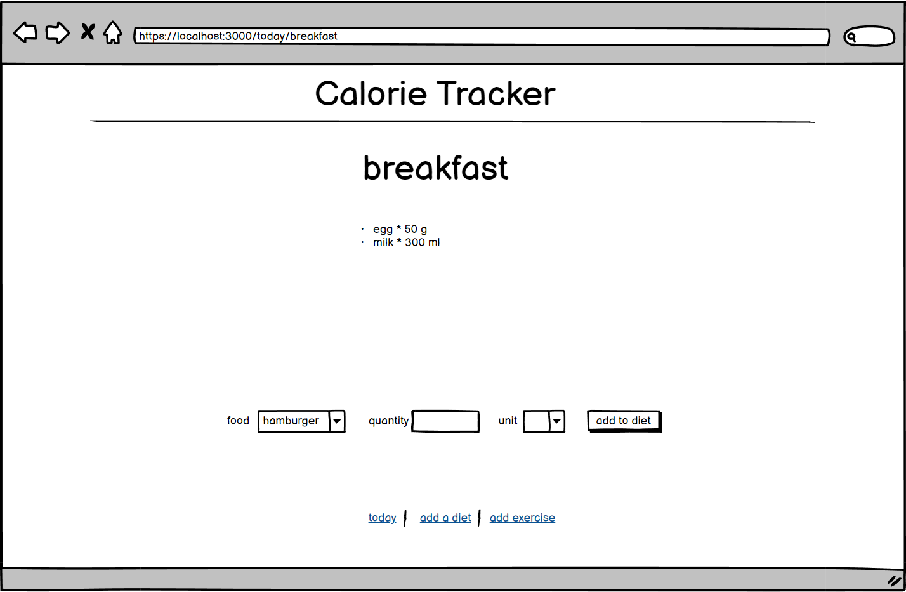
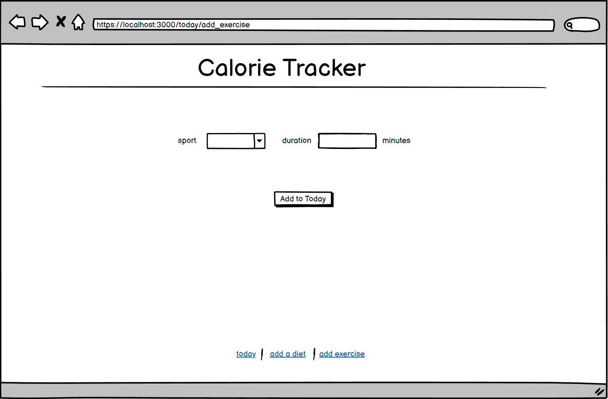
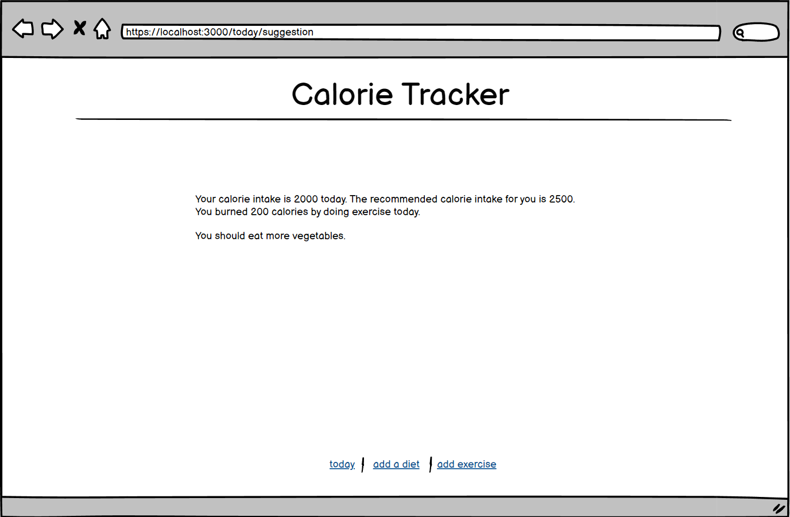
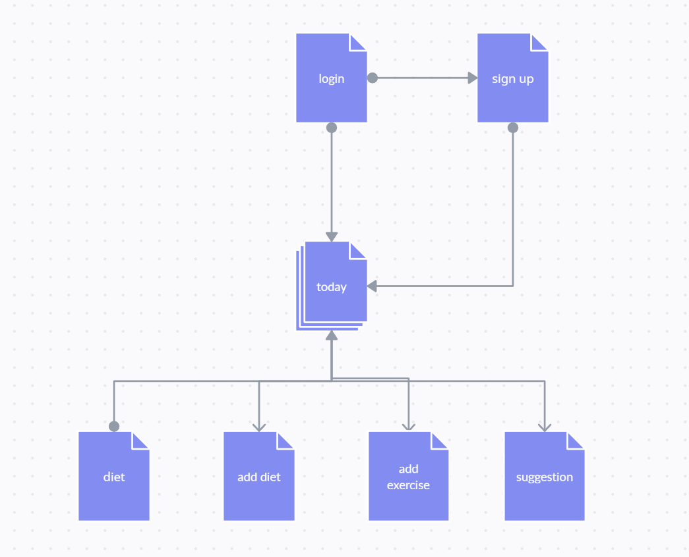

# Calories Tracker

## Overview

Calories Tracker is a web app that will allow users to keep track of how many calories they get and burned everyday. Users can register and login. Users have to enter their gender, weight, and height when during the registration. Once they're logged in, they can record how much food they ate and how much exercise they took on one day, and the corresponding calories will be calculated. Then the app will give suggestion to the users based on their personal data, such as modifying their recipe or suggesting them to do more exercise.

## Data Model


The application will store Users, Diets, Food, Exercise, Sport

* users can have multiple diets everyday
* each Diet can have multiple kinds of food (by embedding)
* Time of exercise everyday is at the discretion of users.

An Example User:

```javascript
{
  username: "username123",
  password: "mypassword123",
  gender: "male",
  age: 18,
  height: 175,
  weight: 60,
  diets: // an array of references to Diets documents
  exercise: // an array of references to Excercise documents
  calorie_intake: 2000,
  calorie_burned: 200
}
```

An Example Diet with Embedded Items:

```javascript
{
  user: // a reference to a User object
  name: "Breakfast",
  food: // an array of food
  
}
```
An Example Food:

```javascript
{
  user: // a reference to a User object
  diet: // a reference to a diet object
  info:  // a refernce to a foodInfo object. the user will not be able to enter texts. They will have a list to choose. 
  quantity: 100
}
```

An Example Exercise:

```javascript
{
  user: // a reference to a User object
  name: "jogging", // the user will not be able to enter texts. They will have a list to choose. 
  duration: "0h 20min 0s",
}
```
An Example FoodInfo:

```javascript
{
    name: 'beef',
    category: 'meat',
    calorie: 250.5,   // kcal/100g
    unit: 'g'
}
```

## [Link to Commented First Draft Schema](db.mjs) 


## Wireframes
/sign_up - page for signing up



/login - page for login



/today - page for showing today's activities



today/new_diet - page for adding a new diet



today/diet_type - page for showing a specific diet



today/add_exercise - page for adding new exercise



today/suggestion - page for showing total calorie intake and burned today and the suggrestion




## Site map



## User Stories or Use Cases

1. as non-registered user, I can register a new account with the site
2. as a user, I can log in to the site
3. as a user, I can create a new diet
4. as a user, I can view all of the diets I've created
5. as a user, I can view all of the exercise I've created
6. as a user, I can view all of the food I've added to an existing diet
7. as a user, I can add food to an existing diet
8. as a user, I can view the calorie intake and burned and the customized suggestion on my diet.

## Research Topics

* (3 points) Perform client side form validation using custom JavaScript or JavaScript library
    *  Client side form validation ensures all required form controls are filled out, in the correct format before submitting data to the server,
    * Client side form validation helps ensure data submitted matches the requirements set forth in the various form controls.
    * The user can fix the invalid data staight away to prevent sending bad data to server.
* (5 points) Automated functional testing for all of your routes using Headless Chrome
    * I will follow the instructions in `https://developer.chrome.com/blog/headless-karma-mocha-chai/`.
    * Headless Chrome is a way to run the Chrome browser without the full browser UI. 
    * I'm using Headless Chrome because my JavaScript tests will be executed in the same environment as users of your site.
    * I will use Karma as a runner and Mocha+Chai for authoring tests.
8 points total out of 8 required points

## [Link to Initial Main Project File](app.mjs) 

## Annotations / References Used

1. [Client-side form validation](https://developer.mozilla.org/en-US/docs/Learn/Forms/Form_validation)
2. [tutorial on Headless Chrome](https://developer.chrome.com/blog/headless-karma-mocha-chai/)

