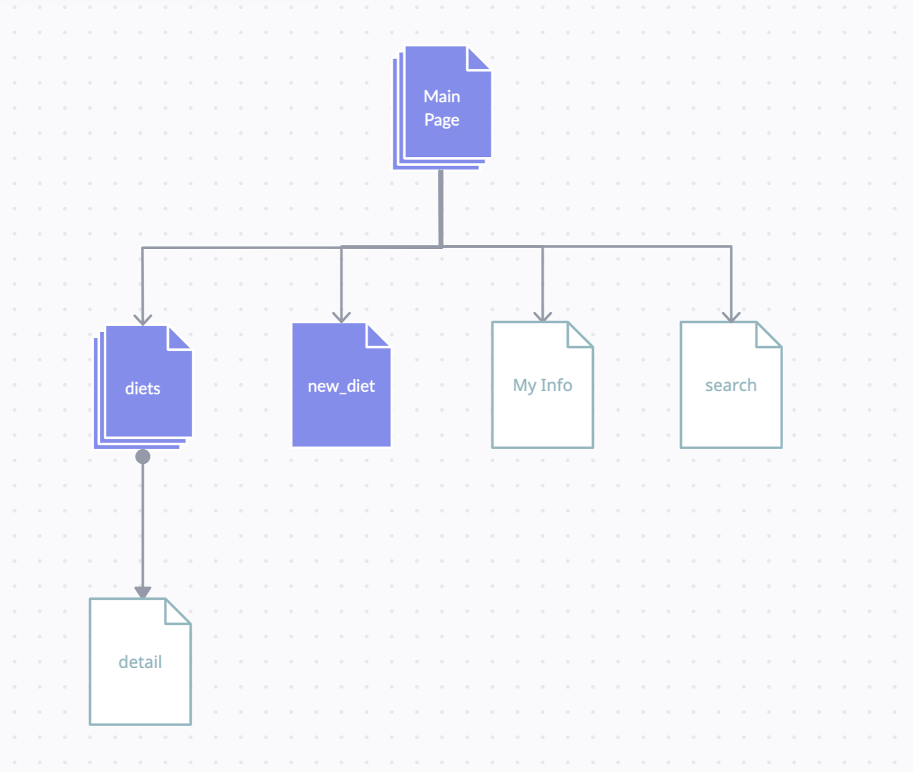

# Calorie Tracker

## Overview

Calories Tracker is a web app that will allow users to keep track of their intake of calories. Users can register and login. Once they're logged in, they can record how much food they ate, and then the users can view the calculated calories. Users can also search information about food(ingredients) and see the information about calories and nutrients. Auth0 is used for login and registration.

## Data Model

The application will store Diets, and Food. There is also a database which stores the information of food.

* users can have multiple diets everyday.
* each Diet consists of different kinds of food(by embedding).
* The user will not be able to enter texts when selecting food. They will have a list of food to choose. 

An Example Diet with Embedded Items:

```javascript
{
  dietName: "breakfast",
  food: // an array of id of food
  id: // unique id for diets with the same name
  userEmail: "1234@bar.edu",
  totalCalorie: 25000
}
```
An Example Food:

```javascript
{
  foodName: "beef",
  quantity: 100
}
```
An Example FoodInfo:

```javascript
{
    name: 'beef',
    calorie: 250.5,   // kcal/100g
    unit: 'g'
}
```

## [Link to Commented First Draft Schema](db.mjs) 


## Wireframes

/ - page for showing today's activities


/new_diet - page for adding a new diet


/diets - page for showing all of the diets


/{diet}_{id} - page for showing


/info - page for showing the information of user.


/search - page for searching the information of food(ingredients).


## Site map



## User Stories or Use Cases

1. as non-registered user, I can register a new account with the site
2. as a user, I can log in to the site
3. as a user, I can create a new diet
4. as a user, I can view all of the diets I've created
5. as a user, I can view all of the food I've added to an existing diet
6. as a user, I can view the total calorie intake from all of the diets.
7. as a user, I can search the information of the an ingredient.
8. as a user, I can filter the diets to check diets with calorie intake higher than the number you entered.

## Research Topics

* (3 points) Configuration management
    * I follow the instructions on `https://www.npmjs.com/package/dotenv`.
    * Dotenv is a zero-dependency module that loads environment variables from a .env file into process.env. Storing configuration in the environment separate from code is based on The Twelve-Factor App methodology.
    * I'm using Dotenv to load the information of authentication.
* (3 points) Perform client side form validation using custom JavaScript or JavaScript library
    * Client side form validation ensures all required form controls are filled out, in the correct format before submitting data to the server.
    * Client side form validation helps ensure data submitted matches the requirements set forth in the various form controls.
    * The user can fix the invalid data straight away to prevent sending bad data to server.
* (2 points) Use a CSS framework or UI toolkit.
    * I use Bootstrap to design the layout of the app.
    * Bootstrap is a development framework that helps create beautiful, responseive layouts using human-friendly HTML.
* (3 points) Use two external API.
    * (1 point) Auth0
      * I use Auth0 to do authentication. The web page is `https://auth0.com/`.
      * This API simplies the process of authentication and can easily add API provided by google for future development.
    * (2 points) Spoonacular
      * I follow the instructions on `https://spoonacular.com/food-api`.
      * I use Spoonacular API to retrieve the information of the food being searched.
      * Initially I intended to use this API to allow users to enter the food in text and retreive the calories from Spoonacular, but doing this will decrease the number of mongoose schema by one, and make me lose a chance to practice implementing the interaction between mongodb and express. Therefore I decide to allow user searching information of food through Spoonacular API as an extra function.
    10 points total out of 10 required points

## [Link to Initial Main Project File](app.mjs) 

## Annotations / References Used

1. [Client-side form validation](https://developer.mozilla.org/en-US/docs/Learn/Forms/Form_validation)
2. [Auth0](https://auth0.com/)
3. [Bootstrap](https://getbootstrap.com/docs/5.2/getting-started/introduction/)
4. [Spoonacular](https://spoonacular.com/food-api)
